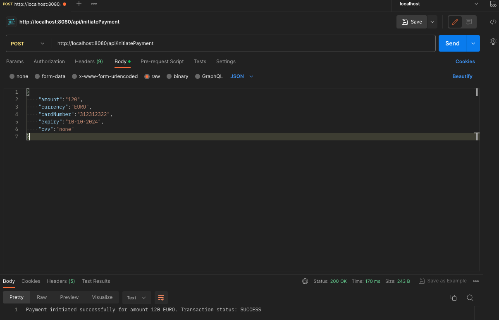

# Getting Started
1) run spring boot application
2) start postman and initialise the REST Call with POSTMAN http://localhost:8080/api/initiatePayment

### Reference Documentation
www.jrevolt.com/media/3 or from MEDIUM https://medium.com/@urfan_62417

### Guides
The following guides illustrate how to use some features concretely:

* [Accessing data with H2 db](https://spring.io/guides/gs/accessing-data-mysql/)
* [Building a RESTful Web Service](https://spring.io/guides/gs/rest-service/)
* [Serving Web Content with Spring MVC](https://spring.io/guides/gs/serving-web-content/)
* [Building REST services with Spring](https://spring.io/guides/tutorials/rest/)
* [Accessing Data with JPA](https://spring.io/guides/gs/accessing-data-jpa/)
* [Producing a SOAP web service](https://spring.io/guides/gs/producing-web-service/)

